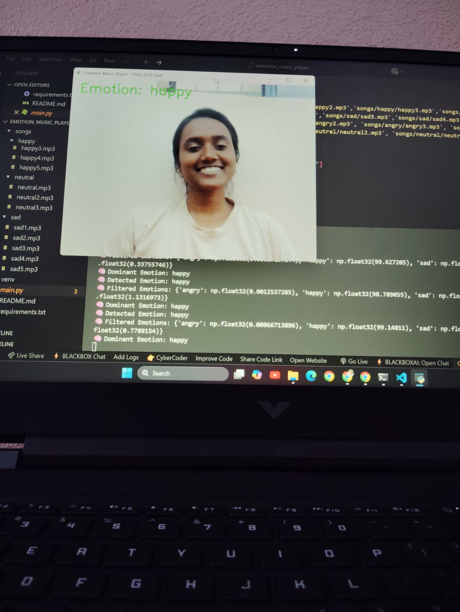
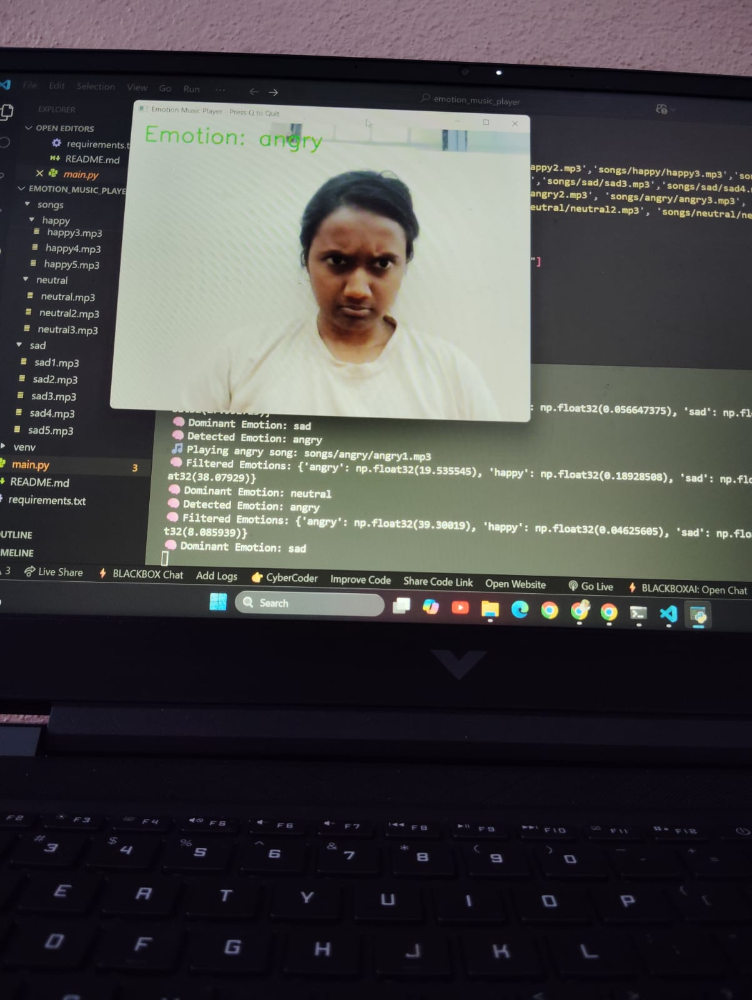

## Emotion Music Player

An AI-powered real-time emotion detection app that plays music based on your facial expressions using DeepFace, OpenCV, and Pygame.  
Built with Python 3.10.
---
##  Features
-  Real-time webcam feed using OpenCV
-  Emotion detection with DeepFace
-  Automatic music playback based on detected emotion
-  Switches songs when your emotion changes
-  Detection refresh every 3 seconds for performance
---
## Tech Stack
- Python 3.10
- DeepFace – Facial expression recognition
- OpenCV– Video capture & image processing
- Pygame – Music playback

---
## screenshots

